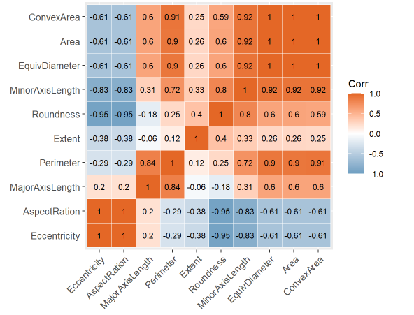
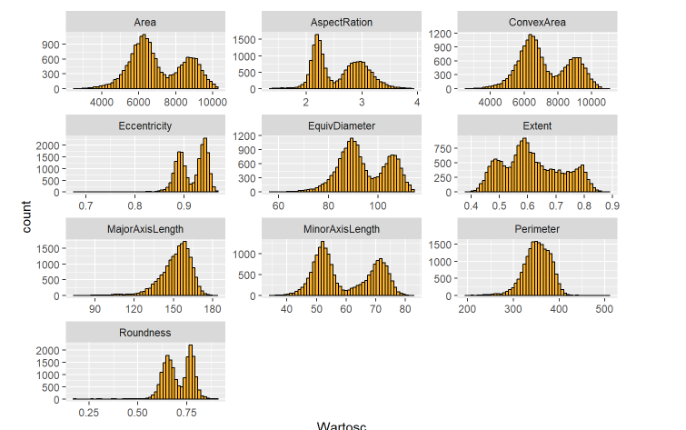
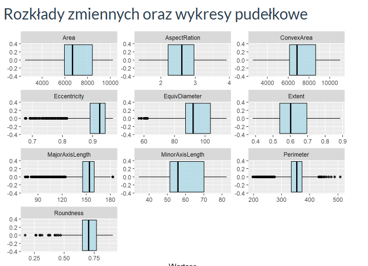
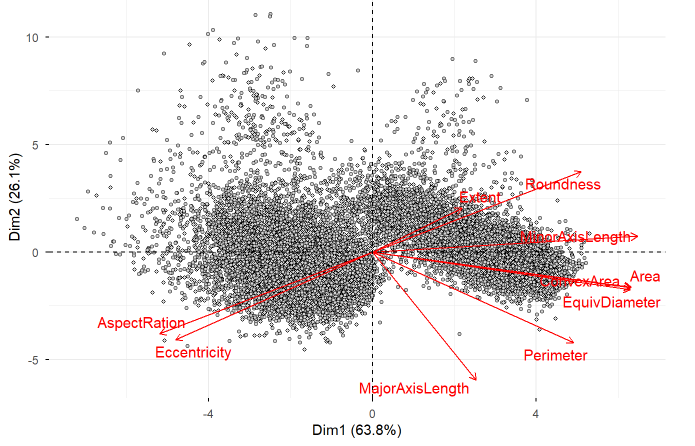
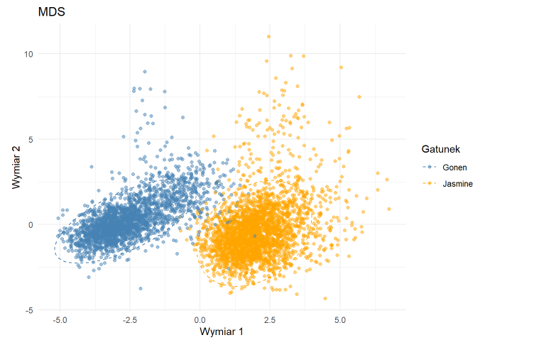

# Redukcja Wymiarów (Analiza Danych Wielowymiarowych)

### Analiza statystyczna i wizualizacja w języku R

### 1. Macierz Korelacji

### 2. Rozkład danych

### 3. Wykresy pudełkowe

### 4. Biplot PCA

### 5. Skalowanie Wielowymiarowe (MDS)

## Instrukcja Uruchomienia (How to Run)

### Podgląd gotowego raportu (HTML)

1.  Pobierz plik raportu (`Projekt_Redukcja_Wymiarow.html`) na swój dysk.
2.  Kliknij na niego dwukrotnie, aby otworzyć go w dowolnej przeglądarce internetowej.

### Uruchomienie kodu (RStudio)
Aby edytować kod lub wygenerować raport samodzielnie:
1.  **Pobierz całe repozytorium** i rozpakuj je.
2.  Upewnij się, że plik z danymi **`riceClassification.csv`** znajduje się w tym samym folderze co plik `.Rmd`.
3.  Otwórz plik projektu (np. `Projekt_Redukcja_Wymiarow.Rmd`) w programie **RStudio**.

4.  W razie potrzeby zainstaluj wymagane biblioteki
